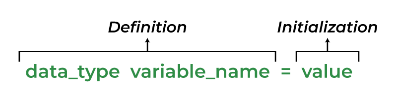

# Variables 
Variables are noting but a way to store value in our program. You can think as variables are like box to store some data in it. In any programming language there is different variables ( boxes ) to store different values. These values are stored in memory. 

In c++ we have define and declare the variable before use it. Its like telling the c++ compiler what kind of variables ( boxes ) you have before compiling the program and then we have to assign the value that is also called initialization of variable. 

example - 
```cpp

#include <iostream>

int main(){

int variable1 ; //variable definition
variable1 = 100; //initialization of variable 

std::cout<<variable1<<std::endl;

int variable2 = 200; // definition = declaration + initialization

std::cout<<variable2<<std::endl;

int x = 10, y = 20, z = 30; //multiple variables definition

std::cout << x << " " << y << " " << z << std::endl;

int a(10), b(20), c(30); // another way to define multiple variables

std::cout << a << " " << b << " " << c << std::endl;

}
```
In the above example **int** is the data type and **variable1** is the name of variable and **100** is the value of that variable.



### Rules for declartion of variables - 

1. Variable name can only contain alphabet,number,underscores only.
2. Cannot contain white space and special character (ex #,$,%,*,&,^ etc).
3. Variables name should always start with alphabet or underscore.
4. Variables name cannot be c++ reserved keywords.
5. Variables names are case sensitive. 